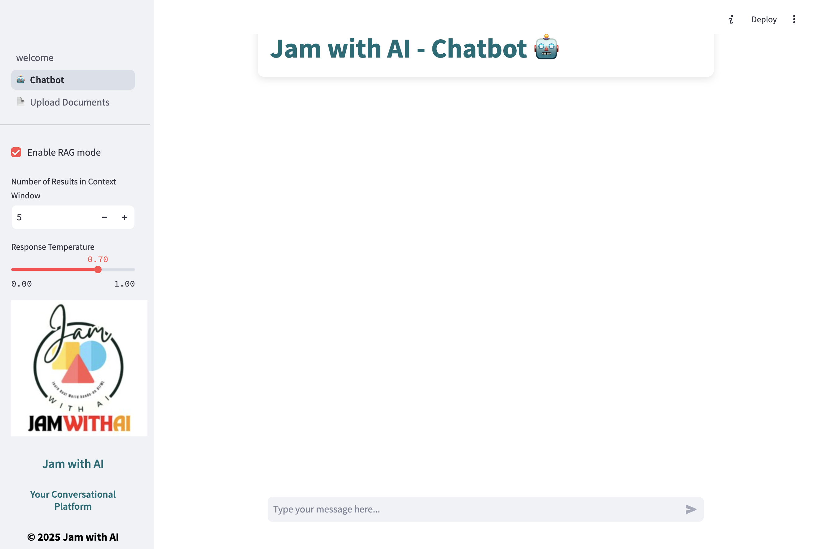

# 📝 Build Your Local RAG System with LLMs

Welcome to the **Local LLM-based Retrieval-Augmented Generation (RAG) System**! This repository provides the full code to build a private, offline RAG system for managing and querying personal documents locally using a combination of OpenSearch, Sentence Transformers, and Large Language Models (LLMs). Perfect for anyone seeking a privacy-friendly solution to manage documents without relying on cloud services.



### 🌟 Key Features:
- **Privacy-Friendly Document Search:** Search through personal documents without uploading them to the cloud.
- **Hybrid Search with OpenSearch:** Uses both traditional text matching and semantic search.
- **Easy Integration with LLMs**: Leverage local LLMs for personalized, context-aware responses.

### 📋 Prerequisites

- **Python 3.11 or 3.12** — the pinned `torch==2.4.1` has no wheels for 3.13+.
- **Docker** — OpenSearch publishes no macOS build, so it must run in a container.
- **Ollama** — serves the local LLM.
- **Tesseract + Poppler** — OCR for scanned PDFs (`brew install tesseract poppler`).

### 🚀 Get Started

1. **Create the environment and install dependencies:**
   ```bash
   uv venv -p python3.12 .venv        # or: python3.12 -m venv .venv
   source .venv/bin/activate
   uv pip install -r requirements.txt # or: pip install -r requirements.txt
   ```

2. **Start OpenSearch** (needs the `knn` and `neural-search` plugins, both bundled in the official image):
   ```bash
   docker run -d --name opensearch \
     -p 9200:9200 -p 9600:9600 \
     -e "discovery.type=single-node" \
     -e "DISABLE_SECURITY_PLUGIN=true" \
     -e "OPENSEARCH_JAVA_OPTS=-Xms1g -Xmx1g" \
     --restart unless-stopped \
     opensearchproject/opensearch:2.19.2
   ```

3. **Create the hybrid search pipeline.** This blends the BM25 and semantic scores; the app's
   queries fail without it, since `hybrid_search()` requests it by name.
   ```bash
   curl -X PUT "localhost:9200/_search/pipeline/nlp-search-pipeline" \
     -H 'Content-Type: application/json' -d '{
     "description": "Post processor for hybrid search",
     "phase_results_processors": [
       {
         "normalization-processor": {
           "normalization": { "technique": "min_max" },
           "combination": {
             "technique": "arithmetic_mean",
             "parameters": { "weights": [0.3, 0.7] }
           }
         }
       }
     ]
   }'
   ```

4. **Start Ollama and pull the model** named in `src/constants.py`:
   ```bash
   ollama serve &
   ollama pull llama3.2:1b
   ```

5. **Configure `src/constants.py`** if you want a different embedding model or LLM. If you change
   the embedding model, update `EMBEDDING_DIMENSION` to match and delete the existing index —
   the mapping's vector dimension is fixed at creation time.

6. **Run the Streamlit app:**
   ```bash
   streamlit run Welcome.py
   ```
   Then open <http://localhost:8501>. Upload PDFs on the **Upload Documents** page first, then
   ask questions about them on the **Chatbot** page with hybrid search enabled.

### 🔧 Troubleshooting

- **Hybrid search returns an error** — the `nlp-search-pipeline` is missing; re-run step 3.
- **Empty or zero-length text extracted from a PDF** — the file is likely scanned images rather
  than embedded text. Tesseract handles this via `src/ocr.py`.
- **Index dimension mismatch on upload** — `EMBEDDING_DIMENSION` no longer matches the model.
  Delete the `documents` index and re-upload.

---

Enjoy your journey in building a private, AI-driven document management system! If you find this project useful, consider sharing it with others in the community!
